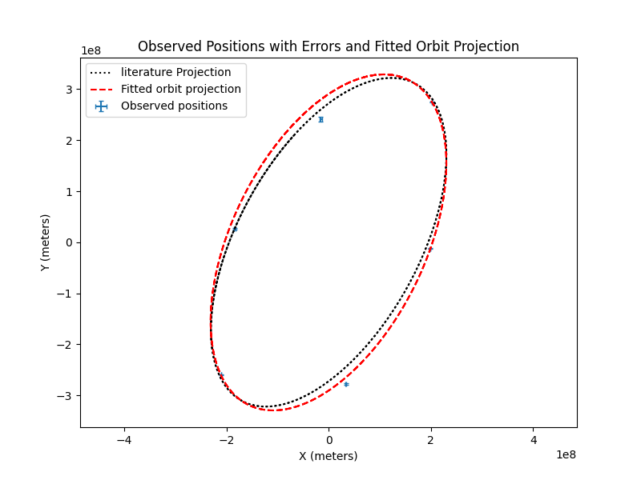
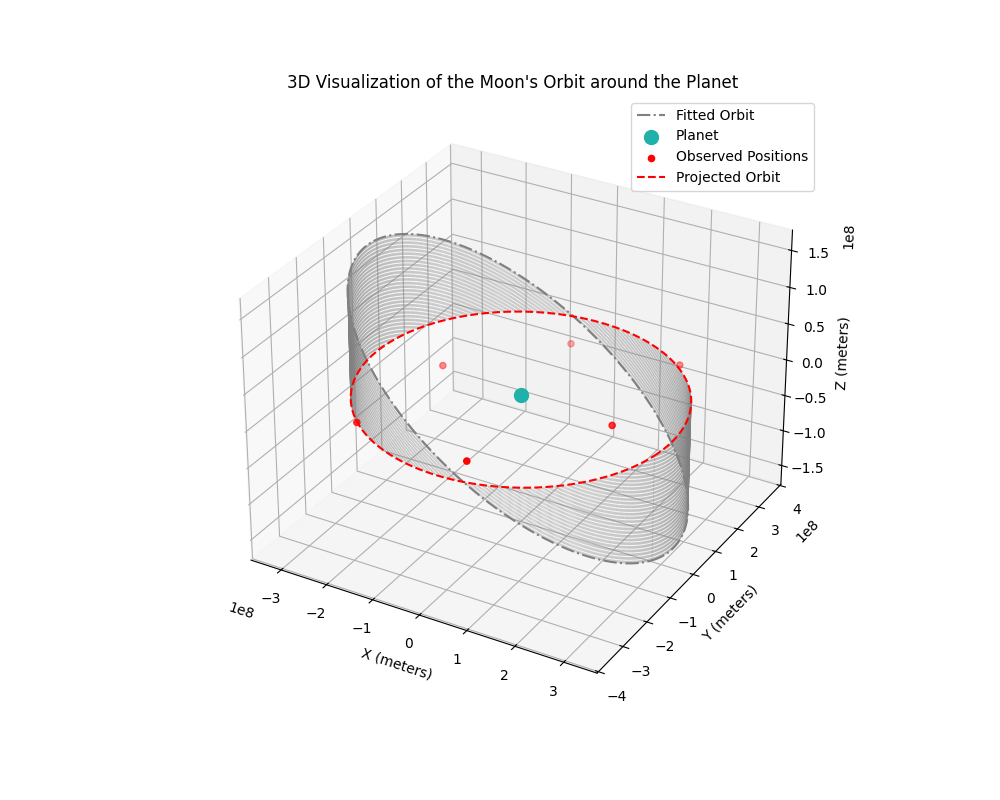

# Orbital Fitting Algorithm


This project implements an **orbital fitting algorithm** to determine the orbit of a moon around Neptune using observational data. Leveraging Python libraries such as **NumPy**, **SciPy**, and **Matplotlib**, the algorithm processes data, fits orbital parameters, and visualizes the results in both 2D and 3D.

## Table of Contents

- [Features](#features)
- [Sample Results](#sample-results)
- [Technologies Used](#technologies-used)
- [Code Highlights](#code-highlights)
- [Project Structure](#project-structure)
- [License](#license)

## Features

- **Data Processing:** Reads and processes observational data from CSV files.
- **Orbital Parameter Estimation:** Utilizes least squares optimization to fit orbital parameters.
- **Visualization:** Generates 2D and 3D plots to visualize observed data and fitted orbits.
- **Uncertainty Analysis:** Provides estimates of uncertainties in the fitted parameters.

## Sample Results

### Observed vs. Fitted Orbit


*Figure 1: Comparison of Observed Positions with Fitted Orbit Projection*

### 3D Orbit Visualization


*Figure 2: 3D Visualization of the Moon's Orbit around Neptune*

## Technologies Used

- **Programming Language:** Python
- **Libraries:**
  - [NumPy](https://numpy.org/) for numerical computations
  - [SciPy](https://www.scipy.org/) for optimization
  - [Matplotlib](https://matplotlib.org/) for data visualization
- **Methodologies:**
  - Least Squares Optimization
  - Solving Kepler's Equation
  - Data Visualization

## Code Highlights

### Solving Kepler's Equation

```python
def solve_kepler(M, e, tol=1e-12, max_iter=200):
    """
    Solves Kepler's Equation M = E - e*sin(E) for E using the Newton-Raphson method.

    Parameters:
        M (numpy.ndarray): Mean anomaly (radians)
        e (float): Eccentricity
        tol (float): Tolerance for convergence
        max_iter (int): Maximum number of iterations

    Returns:
        numpy.ndarray: Eccentric anomaly (radians)
    """
    E = M.copy()
    for _ in range(max_iter):
        f = E - e * np.sin(E) - M
        f_prime = 1 - e * np.cos(E)
        delta_E = -f / f_prime
        E += delta_E
        if np.max(np.abs(delta_E)) < tol:
            break
    return E
